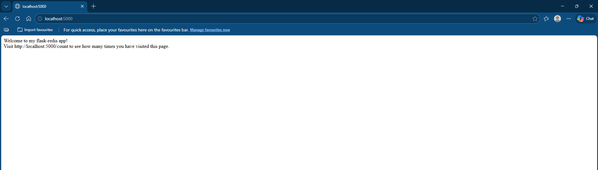
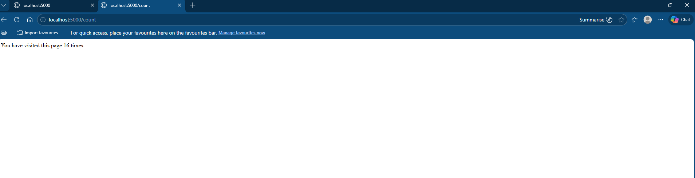

# 🐳 Docker Flask Redis App

A simple Python web application built with **Flask**, containerized using **Docker**, and powered by **Redis** for data storage.

This project demonstrates how to use Docker Compose to run a multi-container application with a Flask backend and a Redis service.

---

## Features

- Flask web application  
- Redis integration for fast in-memory data storage  
- Dockerized setup  
- Multi-container orchestration with Docker Compose  
- Page visit counter using Redis  

---

## Application Preview

### Home Page
  
[View full image](https://github.com/Zakarieh29/docker-flask-redis-app/blob/main/screenshots/home.png)

### 🔢 Visit Counter
  
[View full image](https://github.com/Zakarieh29/docker-flask-redis-app/blob/main/screenshots/count.png)

---

## Tech Stack

- Python (Flask)  
- Redis  
- Docker  
- Docker Compose  

---

## Project Structure

```plaintext
.
├── Dockerfile
├── docker-compose.yml
├── flaskapp.py
├── screenshots/
│   ├── home.png
│   └── count.png
└── README.md
```

---

## How It Works

- The Flask app runs in one container.  
- Redis runs in another container.  
- Docker Compose connects both services together.  
- The `/count` route stores and increments page visits using Redis.  

---

## Getting Started

### 1. Clone the repository

```bash
git clone https://github.com/Zakarieh29/docker-flask-redis-app.git
cd docker-flask-redis-app
```

### 2. Build and Run the Containers

Use Docker Compose to build the images and start the containers:

```bash
docker-compose up --build
```

This command will:

- Build the Flask and Redis Docker images  
- Start the containers and connect them via the Docker network  

> You may need to run `sudo` before the `docker-compose` command depending on your system setup.

### 3. Access the App

After the containers are running, open your browser:

- **Home page:** [http://localhost:5000](http://localhost:5000)  
- **Visit counter page:** [http://localhost:5000/count](http://localhost:5000/count)

These routes allow you to:

- View the home page of the Flask app  
- Track the number of visits using the Redis-powered counter  